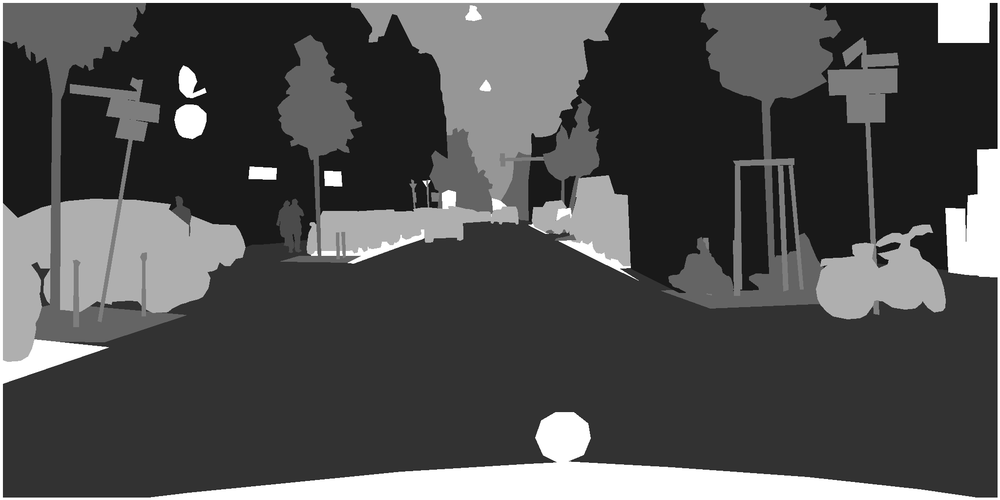

# Aporia
Image Segmentation on CitySpaces database

Synthese of that work in this [article](https://github.com/sha-cmd/Zetetika/raw/master/article_4.pdf). It contains details on the algorithms I used in that project and sums up many random experiences to set the hyperparameters.

This project required some layer construction, from data point in json file. We have use OpenCV to compute them faster. Here is one layer picture, same as those we’ve use to train our model (see our [notebook](notebooks/masks.ipynb)

We have done some MLOps in our [account](https://studio.iterative.ai/user/sha-cmd/views/Aporia-arozg5hnv3) on Iterative Studio.
